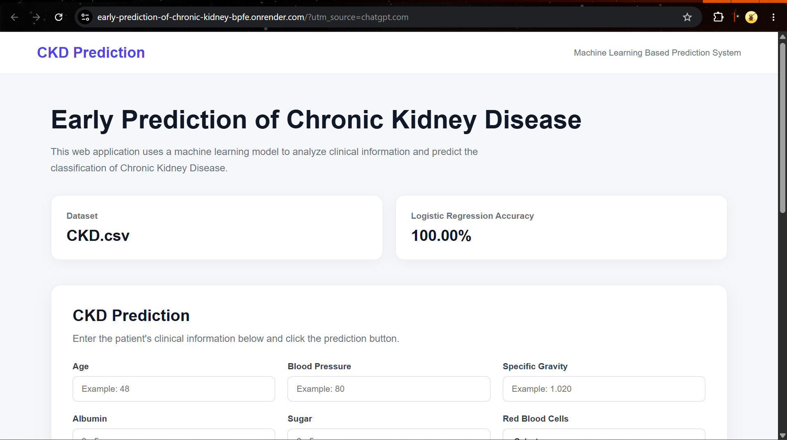
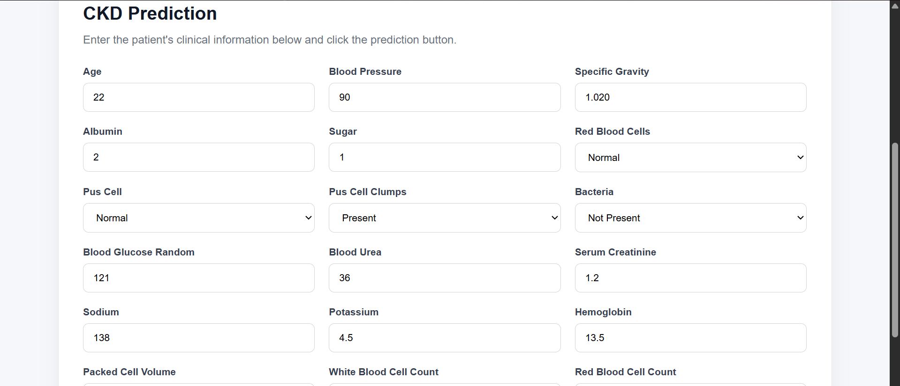
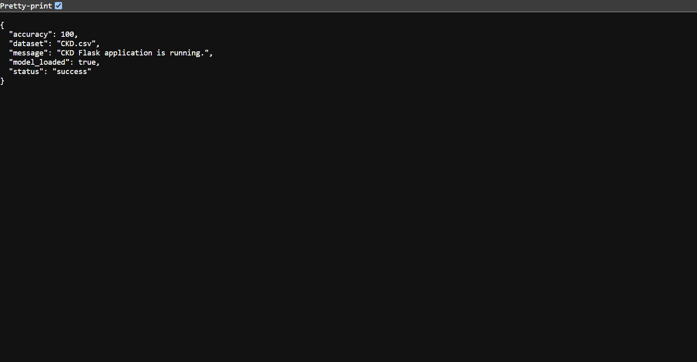

# Early Prediction of Chronic Kidney Disease

A machine learning based web application for predicting Chronic Kidney Disease (CKD) using patient clinical information.

The project originally started as a desktop application and was later converted into a Flask-based web application while keeping the existing machine learning prediction functionality.

---

## 🌐 Live Demo

Try the deployed CKD Prediction System:

https://early-prediction-of-chronic-kidney-bpfe.onrender.com
📦 **GitHub Repository:
 https://github.com/sairanga06/Early-Prediction-of-Chronic-Kidney-Disease

---

## 📌 Project Overview

Chronic Kidney Disease (CKD) is a serious health condition that can be difficult to identify at an early stage.

This project uses machine learning to analyze clinical parameters and predict whether a patient is likely to belong to the CKD or non-CKD class.

The application provides a web-based interface where users can enter patient clinical information and receive a machine learning prediction.

> **Disclaimer:** This application is developed for educational and project demonstration purposes only. The prediction should not be considered a medical diagnosis or a substitute for professional medical advice.

---

## ✨ Features

- Machine learning based CKD prediction
- Flask web application
- Responsive web interface
- 24 clinical input features
- Logistic Regression model
- CKD dataset loading and preprocessing
- Input validation
- Prediction API
- Health-check API
- Prediction result display
- Clear Form functionality
- Error handling
- GitHub integration
- Cloud deployment using Render
- Live prediction system

---

## 🛠️ Technologies Used

### Programming Language

- Python

### Backend

- Flask
- Gunicorn

### Machine Learning

- Scikit-learn
- Logistic Regression
- Pandas
- NumPy

### Frontend

- HTML5
- CSS3
- JavaScript

### Tools

- Visual Studio Code
- Git
- GitHub
- Render

---

## 📂 Project Structure

```text
Early-Prediction-of-Chronic-Kidney-Disease-main
│
├── Dataset
│   └── CKD.csv
│
├── web_app
│   ├── app.py
│   │
│   ├── templates
│   │   └── index.html
│   │
│   └── static
│       └── style.css
│
├── .gitignore
├── README.md
├── requirements.txt
└── ...
---

## 📸 Application Screenshots

### 🏠 Home Page



---

### 📝 Prediction Form


---

### 🩺 Prediction Result



---

### 🔍 Health Check



---